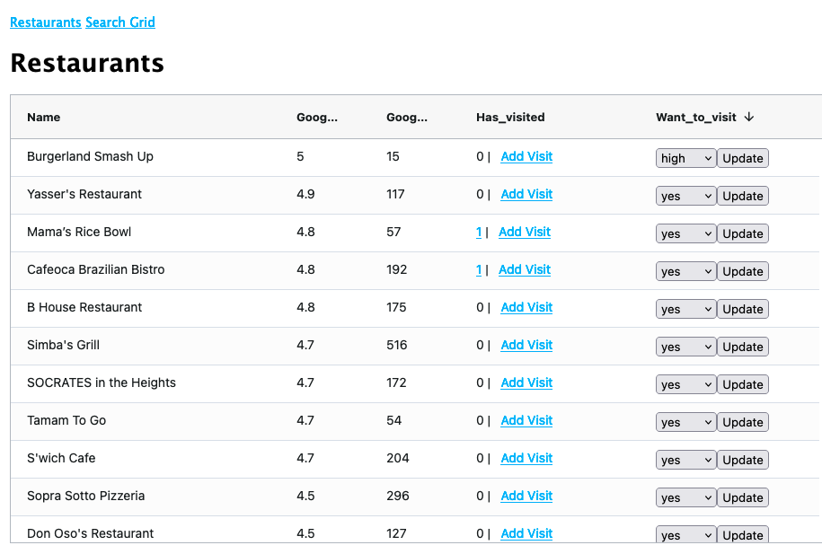

# Restaurant Tracker

## Summary

This app helps organize all your restaurant activities!  You can:
* Find all the restaurants in a given area (via Google Places API)
* Filter out chains that you're not interested in 
* Mark restaurants that you want or don't want to visit
* Keep track of past visits

Here's a screenshot:


## Why not just use Google Directly?

This app makes repeated calls to the Google API to get an exhaustive list of all restaurants.  For other ways of searching, it's hard to know if you have ALL the restaurants.

Normal usage of Google's APIs only gives 60 results, regardless of how many there are.  This app iteratively breaks down the search area to smaller and smaller quadrants to ensure all restaurants are discovered.  This functionality is based on the work of Sam Thomas:
https://github.com/samuelfullerthomas/argo

His project outputs a CSV for local usage.  Differences in this app:
* Data is stored in a local SQLite database, which can be examined with tools like https://sqlitebrowser.org/
* Has a (ugly) UI to input lat/long as opposed to config files
* Displays results in a flexible [Ag Grid](https://www.ag-grid.com/) which allows for easy sorting and filtering
* Enables the ability to record visits

## Getting Started

You need a Google Places API token to use this.  This is a paid API, but Google gives you (as of early 2022) a certain amount of free credit each month.  Be careful when you are doing restaurant searches in the grid, particularly in areas with lots of restaurants.  Start small and check on API consumption before going further.

After you have your token:
```sh
$ export GOOGLE_API_KEY=my_token
```

Clone the repo locally and install the javascript dependencies:
```sh
$ npm install
```

Run the app:
```sh
$ npm start
```

You can now navigate to http://localhost:3000 to really get started :)